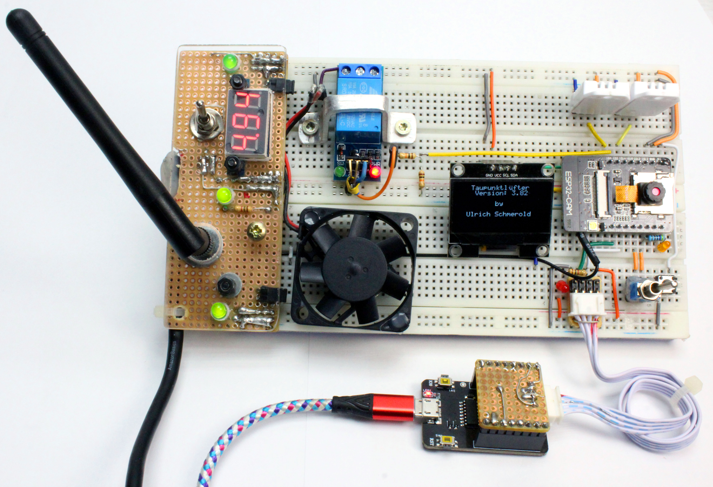

Maker Media GmbH

***

# Das Taupunkt-Lüftungssystem V3

## Ein Make-Projekt mit der ESP32-CAM

Zwei Klimasensoren, ein Relais zum Schalten eines amtlichen Lüfters und ein Mikrocontroller-Board, was alles steuert – viel mehr braucht es nicht, um mit minimalem Aufwand einen feuchten Keller trockenzulegen, durch geschicktes Ausnutzen des unterschiedlichen Feuchtigkeitsgehalts der Luft drinnen und draußen.

Hier gibt es den Code zum Projekt im Ordner _src_.

Dieses Projekt erfordert die Installation folgender Bibliotheken über die Bibliotheksverwaltung der Arduino IDE:
 - [DHT sensor library](https://github.com/adafruit/DHT-sensor-library) von _Adafruit_
 - [ESP32Time](https://github.com/fbiego/ESP32Time) von _fbiego_
 - [AsyncTCP](https://github.com/dvarrel/AsyncTCP) von _dvarrel_
 - [GyverOLED](https://github.com/GyverLibs/GyverOLED) von _AlexGyver_

Der vollständige Artikel zum Projekt steht im **Make-Special ESP32-CAM 2023** ab Seite 50.

Die vorigen Versionen des Projekt gibt es in diesem [GitHub-Repository](https://github.com/MakeMagazinDE/Taupunktluefter).
